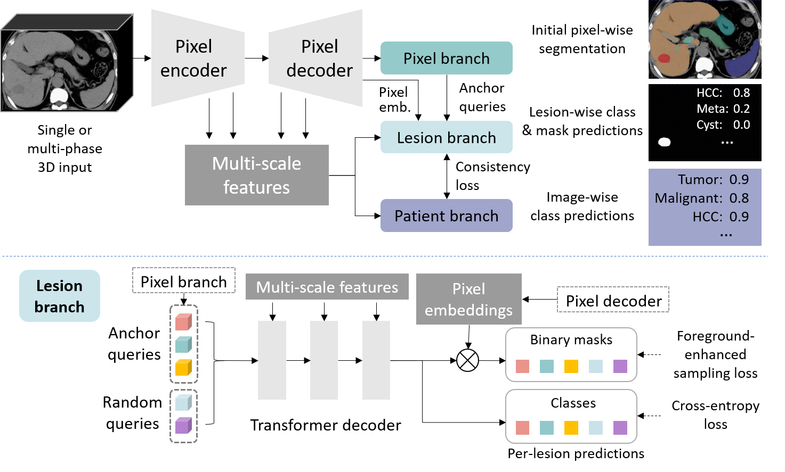

# Pixel-Lesion-pAtient Network (PLAN)

This is the code for Pixel-Lesion-pAtient Network (PLAN), a lesion segmentation and classification network for 3D 
medical images. It combines traditional pixel-level semantic segmentation, object(lesion)-level instance segmentation,
and patient-level image classification into one end-to-end network. Please see our paper:
* Ke Yan, Xiaoli Yin, Yingda Xia, Fakai Wang, Shu Wang, Yuan Gao, Jiawen Yao, Chunli Li, Xiaoyu Bai, Jingren Zhou, 
Ling Zhang, Le Lu, Yu Shi, "Liver Tumor Screening and Diagnosis in CT with Pixel-Lesion-Patient Network," International 
Conference on Medical Image Computing & Computer Assisted Intervention (MICCAI), 2023 ([arXiv](https://arxiv.org/abs/2307.08268)).



This repo is based on the original [nnUNet v1](https://github.com/MIC-DKFZ/nnUNet/tree/nnunetv1).
It also borrows from [MaskFormer](https://github.com/facebookresearch/MaskFormer) and 
[Mask2Former](https://github.com/facebookresearch/Mask2Former).

The code is designed for the liver tumor segmentation and classification task in NC and DCE CT. But you can also modify
the dataloader and configs to accommodate other single/multi-modality segmentation tasks. I hope to make the 
project more configurable and flexible for extension.

## Features
* Support original nnUNet, 3D Mask2Former, and PLAN, see `nnunet/network_architecture`.
* You can easily specify all hyper-parameters in config files, including folders, gpu, data, data loader, trainer, 
network, optimizer, validation folders, etc. We provided some examples in `configs/`.
* I carefully wrote the post-processing code and evaluation code for lesion segmentation. It can generate segmentation
mask and patient-level results during inference. Pixel-level (segmentation), lesion-level (detection), and patient-level 
(multi-label classification) accuracy will be thoroughly computed. A case report recording accuracy of each case will 
also be generated.
* The whole process of training, testing, and evaluation can be run in one line e.g. `python main.py --cfg nc_plan1`.

## Usage
1. Build a virtual environment with `Python 3`.
2. Step into the project folder and install by `pip install -e .`.
3. Prepare data, please refer to `nnunet/dataset_conversion/my_dataset_prepare.py`. It is also helpful to read the 
documents of [nnUNet v1](https://github.com/MIC-DKFZ/nnUNet/tree/nnunetv1).
4. Use nnUNet's preprocess command to preprocess data and generate training plan:
```
UNet_plan_and_preprocess -t XXX -pl2d None
```
`task_id` can be any number. This process takes a while. Make sure your disk has enough space (>10G at least) 
because this step will produce large processed files. It will also produce a 5-fold split file.
* Modify parameters in config files, e.g. `exp_name` and `results_dir`. Modify `cfg.mode` depending on whether you want
to train / continue training / inference / compute accuracy.
* `python nnunet/run/main.py --cfg <config_file>`. An example of `config_file` is `nc_plan1`, which corresponds to the filename
`cfg_nc_plan1.py`.
* The training code will train and validate on fold `cfg.fold` for `cfg.optimizer.max_num_epochs` epochs. 
Validation in each epoch is only conducted on some random patches. When training is complete, it will 
validate on all validation folders specified in `cfg.validation.folders`. Then it will run evaluation
and compute accuracy, see parameters in `cfg.validation`.


## Important files
* `panoSegTrainer` is the trainer class I am using.
* Configs are in `configs/`, each file is an experiment config. `cfg_default.py` stores default configs that will be
overwritten by other configs. 
* Dataset classes are in `nnunet/training/dataloading`.
* Post-processing is in `nnunet/inference/post_process.py`.
* Evaluation of differential diagnosis accuracy is in `nnunet/evaluation/evaluation_diagnosis.py`, while evaluation of 
lesion screening is in `evaluation_screening.py`.

My email: yankethu@gmail.com